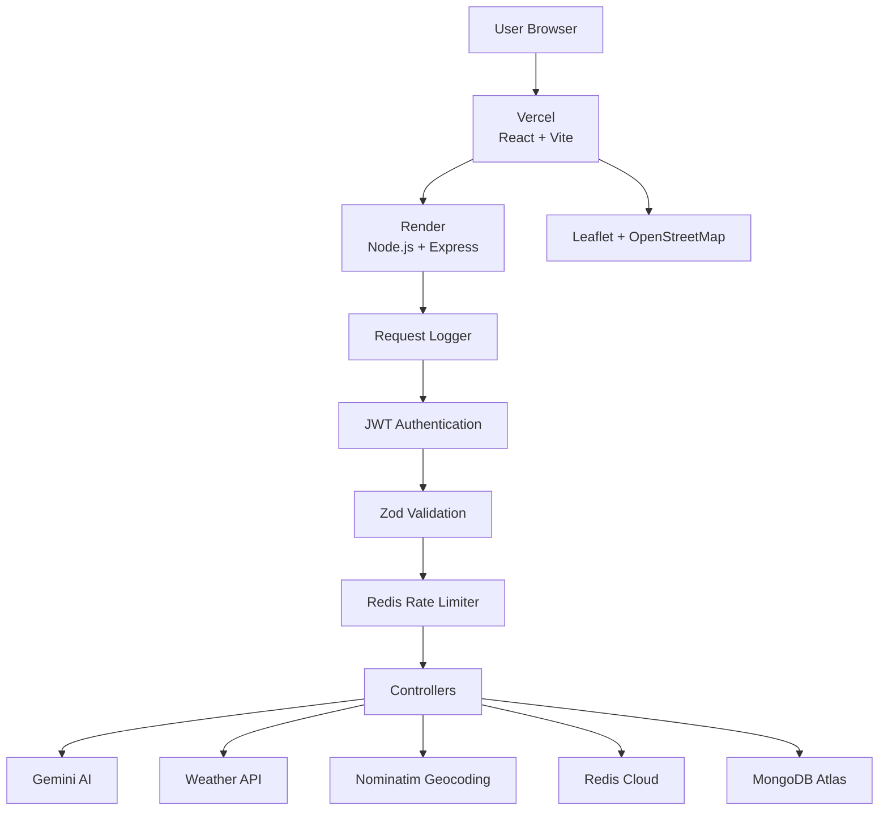

# ✈️ SmartTrip AI

> An AI-powered full-stack travel planning platform that generates personalized itineraries while combining AI recommendations with deterministic backend logic, weather forecasting, interactive maps, Redis caching, rate limiting, secure authentication, automated testing, and CI/CD.

---

## 🌐 Live Application

### Frontend
https://smart-trip-blue.vercel.app

### Backend API
https://smarttrip-dt6j.onrender.com

### Backend Health Check
https://smarttrip-dt6j.onrender.com/api/health

### GitHub Repository
https://github.com/vikashkumar016/SmartTrip

---

# 📌 About The Project

SmartTrip AI is a full-stack travel planning application where users can create and manage trips and generate personalized travel itineraries using Gemini AI.

A user provides:

- Destination
- Start and end dates
- Budget
- Number of travelers
- Travel interests

SmartTrip then creates a day-wise itinerary containing locations, activities, timings, descriptions, estimated costs, map coordinates, budget analysis, and weather information.

The project was designed not only as an AI application but also to demonstrate backend and software-engineering concepts such as:

- Authentication
- Authorization
- REST API design
- Redis caching
- Rate limiting
- Request validation
- Centralized error handling
- API logging
- Automated testing
- Mocking
- CI/CD
- Cloud deployment
- Security hardening

---

# ✨ Main Features

## 🔐 Authentication

SmartTrip provides secure user authentication using JWT.

Features:

- User registration
- User login
- Password hashing using bcrypt
- JWT-based authentication
- Protected routes
- Persistent frontend authentication
- Logout support

Protected requests send:

```http
Authorization: Bearer <JWT_TOKEN>
```

---

## 🛡 Ownership-Based Authorization

Every trip belongs to a specific authenticated user.

Trip queries use both:

```text
Trip ID
+
Authenticated User ID
```

Example:

```js
Trip.findOne({
  _id: req.params.id,
  user: req.user._id,
});
```

This prevents one user from accessing, modifying, generating an itinerary for, or deleting another user's trip.

---

# 🧳 Trip Management

Authenticated users can:

- Create trips
- View all their trips
- View individual trip details
- Edit existing trips
- Delete trips
- Generate AI itineraries
- Regenerate itineraries

Trip information includes:

- Destination
- Start date
- End date
- Budget
- Number of travelers
- Interests
- Trip status
- AI itinerary
- Budget analysis

---

# 🤖 AI Itinerary Generation

SmartTrip integrates Gemini AI to generate personalized travel plans.

AI input contains:

```text
Destination
Travel dates
Number of days
Budget
Travelers
Interests
```

The AI generates:

- Trip summary
- Day-wise plans
- Activity timings
- Real searchable places
- Activity descriptions
- Estimated activity costs

Example flow:

```text
User
 ↓
Generate Itinerary
 ↓
Express API
 ↓
Gemini Service
 ↓
Structured Itinerary
 ↓
Location Enrichment
 ↓
Budget Analysis
 ↓
MongoDB
 ↓
Frontend
```

---

# 💰 Deterministic Budget Engine

Large Language Models can produce inconsistent numerical calculations.

Because of this, SmartTrip does not blindly trust the AI-generated total cost.

Instead, the backend independently calculates the total activity cost.

The budget service calculates:

- Total activity cost
- Remaining budget
- Budget utilization percentage
- Whether the itinerary exceeds the budget
- Amount over budget

Example:

```text
Trip Budget = ₹10,000

Activities:
₹2,000
₹1,500
₹2,500

Total Activity Cost = ₹6,000

Remaining Budget = ₹4,000

Budget Utilization = 60%
```

This separates:

```text
AI → Recommendations

Backend → Deterministic calculations
```

---

# 🌦 Weather Forecast

SmartTrip provides weather information for upcoming trips.

Weather data is fetched dynamically because weather is volatile and should not be permanently treated as static trip data.

The weather feature includes:

- Destination geocoding
- Daily weather forecast
- Minimum temperature
- Maximum temperature
- Precipitation probability
- Human-readable weather conditions

Weather information is cached using Redis to reduce repeated external API calls.

---

# ⚡ Redis Caching

Redis is used to cache weather results.

SmartTrip follows the:

## Cache-Aside Pattern

Flow:

```text
Weather Request
      ↓
Redis GET
      ↓
 ┌─────────────┐
 │             │
HIT           MISS
 │             │
 ↓             ↓
Return      Weather API
               ↓
          Redis SET
               ↓
            Return
```

A cache key contains information such as:

```text
weather:destination:startDate:endDate
```

Cached data uses a TTL so stale weather information automatically expires.

Benefits:

- Lower latency
- Fewer third-party API calls
- Reduced external dependency usage
- Better scalability

Redis failure does not completely break the weather feature because caching is treated as an optimization rather than the source of truth.

---

# 🚦 Redis Rate Limiting

AI generation is one of the most expensive operations in SmartTrip.

To prevent abuse, AI generation is protected using a Redis-based rate limiter.

The rate limiter uses a:

## Fixed Window Counter

Concept:

```text
Authenticated User
       ↓
Redis Counter
       ↓
Allowed limit?
   ↙          ↘
 YES          NO
 ↓             ↓
Gemini         429
```

Redis stores counters such as:

```text
ratelimit:ai-generate:<userId>
```

Counters automatically expire using TTL.

When the request limit is exceeded, the backend returns:

```http
429 Too Many Requests
```

This protects against:

- AI API abuse
- Excessive quota usage
- Unnecessary server load
- Automated request spam

---

# 🗺 Interactive Trip Maps

SmartTrip displays itinerary activities on an interactive map.

Technologies:

- Leaflet
- React Leaflet
- OpenStreetMap
- Nominatim

After Gemini generates activities:

```text
Activity Place
      ↓
Geocoding Service
      ↓
Latitude + Longitude
      ↓
Saved with Itinerary
      ↓
Displayed on Map
```

Coordinates are persisted with itinerary activities so geocoding does not need to run every time the trip page loads.

---

# ✅ Request Validation

SmartTrip uses Zod for schema-based API request validation.

Validation includes:

- Required fields
- Valid email
- Password constraints
- Destination validation
- Date format validation
- Budget validation
- Traveler validation
- Trip ID validation
- Interest validation

Architecture:

```text
Request
 ↓
JWT Authentication
 ↓
Zod Validation
 ↓
Controller
```

Invalid requests are rejected before unnecessary database operations occur.

Example:

```json
{
  "success": false,
  "message": "Validation failed",
  "details": [
    {
      "field": "budget",
      "message": "Budget cannot be negative"
    }
  ]
}
```

---

# 🚨 Centralized Error Handling

Instead of repeating error response logic inside every controller, SmartTrip uses centralized Express error handling.

Architecture:

```text
Controller
   ↓
throw ApiError
   ↓
asyncHandler
   ↓
next(error)
   ↓
Global Error Middleware
   ↓
Consistent JSON Response
```

Custom error handling supports:

- Invalid MongoDB ObjectIds
- Mongoose validation errors
- Duplicate values
- Missing resources
- Authentication failures
- Rate-limit failures
- Request-size errors
- Unexpected server errors

Example:

```json
{
  "success": false,
  "message": "Trip not found",
  "requestId": "..."
}
```

Production responses avoid exposing internal stack traces.

---

# 📊 API Logging & Observability

SmartTrip includes request-level logging.

Every request can be associated with:

- Request ID
- HTTP method
- URL
- Status code
- Response time
- User ID
- Timestamp

Example:

```text
POST /api/trips/:id/generate
Status: 200
Response Time: 4200ms
User: 68abc...
Request ID: ...
```

Request IDs make production debugging easier because frontend errors can be correlated with backend logs.

Sensitive information is intentionally not logged.

The application avoids logging:

- Passwords
- JWT tokens
- Gemini API keys
- Database credentials
- Redis credentials

---

# 🔒 Security Hardening

SmartTrip uses multiple security layers.

## Helmet

Helmet adds security-related HTTP headers.

## Strict CORS

Only configured frontend origins are allowed by the backend.

Production frontend:

```text
https://smart-trip-blue.vercel.app
```

## Request Body Limits

JSON request size is restricted to protect the server from oversized payloads.

## JWT Authentication

Protected APIs require a valid JWT.

## Authorization

Users can only access resources they own.

## Zod Validation

Invalid requests are rejected early.

## Rate Limiting

Expensive AI routes are protected using Redis.

## Environment Validation

Critical environment variables are validated during server startup.

## Production-Safe Errors

Internal stack traces are not returned to production clients.

This follows a:

## Defense-in-Depth Approach

```text
Helmet
+
CORS
+
JWT
+
Authorization
+
Validation
+
Rate Limiting
+
Safe Error Handling
```

---

# 🏗 System Architecture



---

# 🔄 Backend Request Flow

Typical protected request:

```text
Frontend
   ↓
Express
   ↓
Security Middleware
   ↓
Request Logger
   ↓
JWT Authentication
   ↓
Zod Validation
   ↓
Redis Rate Limiter
   ↓
Controller
   ↓
Service Layer
   ↓
MongoDB / Redis / External APIs
   ↓
Response
```

---

# 🤖 AI Generation Flow

```text
React Frontend
      ↓
POST /api/trips/:id/generate
      ↓
JWT Authentication
      ↓
Trip Ownership Check
      ↓
Rate Limiter
      ↓
Gemini AI
      ↓
Location Service
      ↓
Budget Service
      ↓
MongoDB
      ↓
JSON Response
```

---

# 🛠 Tech Stack

## Frontend

| Technology | Purpose |
|---|---|
| React | UI |
| Vite | Frontend tooling |
| JavaScript | Application language |
| Tailwind CSS | Styling |
| React Router | Client-side routing |
| Leaflet | Maps |
| React Leaflet | React map integration |

---

## Backend

| Technology | Purpose |
|---|---|
| Node.js | Runtime |
| Express.js | REST API |
| JavaScript | Backend language |
| JWT | Authentication |
| bcryptjs | Password hashing |
| Zod | Request validation |
| Helmet | Security headers |

---

## Database

| Technology | Purpose |
|---|---|
| MongoDB | Primary database |
| Mongoose | MongoDB ODM |
| MongoDB Atlas | Production database |

---

## Cache / Infrastructure

| Technology | Purpose |
|---|---|
| Redis | Cache + rate limiter |
| Redis Cloud | Managed production Redis |

---

## AI & External Services

| Technology | Purpose |
|---|---|
| Gemini API | AI itinerary generation |
| Weather API | Weather forecasts |
| Nominatim | Place geocoding |
| OpenStreetMap | Map tiles |

---

## Testing

| Technology | Purpose |
|---|---|
| Vitest | Test runner |
| Supertest | API integration testing |
| mongodb-memory-server | Isolated test database |
| Vitest Mocks | External service mocking |

---

## DevOps / Deployment

| Technology | Purpose |
|---|---|
| Git | Version control |
| GitHub | Source repository |
| GitHub Actions | CI pipeline |
| Render | Backend hosting |
| Vercel | Frontend hosting |
| MongoDB Atlas | Cloud database |
| Redis Cloud | Cloud cache |

---

# 📡 API Documentation

Base production API:

```text
https://smarttrip-dt6j.onrender.com/api
```

---

## Authentication Routes

### Register User

```http
POST /api/auth/register
```

Example body:

```json
{
  "name": "Test User",
  "email": "test@example.com",
  "password": "securepassword"
}
```

---

### Login User

```http
POST /api/auth/login
```

Example:

```json
{
  "email": "test@example.com",
  "password": "securepassword"
}
```

Successful responses return a JWT.

---

# 🧳 Trip Routes

All trip routes require authentication.

## Create Trip

```http
POST /api/trips
```

Example:

```json
{
  "destination": "Goa",
  "startDate": "2026-09-10",
  "endDate": "2026-09-15",
  "budget": 25000,
  "travelers": 2,
  "interests": [
    "Beach",
    "Food",
    "Adventure"
  ]
}
```

---

## Get User Trips

```http
GET /api/trips
```

---

## Get Single Trip

```http
GET /api/trips/:id
```

---

## Update Trip

```http
PATCH /api/trips/:id
```

---

## Delete Trip

```http
DELETE /api/trips/:id
```

---

## Generate AI Itinerary

```http
POST /api/trips/:id/generate
```

---

## Get Trip Weather

```http
GET /api/trips/:id/weather
```

---

# 📋 API Endpoint Summary

| Method | Endpoint | Authentication | Description |
|---|---|---:|---|
| POST | `/api/auth/register` | No | Register user |
| POST | `/api/auth/login` | No | Login user |
| POST | `/api/trips` | Yes | Create trip |
| GET | `/api/trips` | Yes | Get user trips |
| GET | `/api/trips/:id` | Yes | Get trip details |
| PATCH | `/api/trips/:id` | Yes | Update trip |
| DELETE | `/api/trips/:id` | Yes | Delete trip |
| POST | `/api/trips/:id/generate` | Yes | Generate itinerary |
| GET | `/api/trips/:id/weather` | Yes | Get weather |

---

# 📡 Common HTTP Status Codes

| Code | Meaning |
|---:|---|
| 200 | Request successful |
| 201 | Resource created |
| 204 | Successful preflight / no content |
| 400 | Invalid request |
| 401 | Authentication required |
| 403 | Forbidden |
| 404 | Resource not found |
| 409 | Resource conflict |
| 413 | Request too large |
| 429 | Too many requests |
| 500 | Internal server error |

---

# 🧪 Automated Testing

SmartTrip includes unit and integration tests.

---

## Integration Tests

Supertest is used to test the Express APIs.

Tests cover:

- User registration
- User login
- Wrong credentials
- Unauthorized requests
- Trip creation
- Get trips
- Get single trip
- Update trip
- Delete trip
- Request validation
- User authorization
- Cross-user data isolation

Example security test:

```text
User A creates Trip A
        ↓
User B logs in
        ↓
User B requests Trip A
        ↓
404 Trip Not Found
```

This verifies resource ownership protection.

---

## Unit Testing

The budget engine is tested independently.

Tests verify:

- Correct activity cost
- Remaining budget
- Over-budget detection
- Budget utilization
- Empty itinerary handling
- Invalid activity cost handling

---

# 🎭 Mocking External Services

External services should not make automated tests:

- Slow
- Expensive
- Network-dependent
- Non-deterministic

Therefore SmartTrip mocks:

- Gemini AI
- Geocoding service

During testing:

```text
Controller
    ↓
Mock Gemini
    ↓
Mock Geocoder
    ↓
Real Budget Logic
    ↓
MongoDB Test Database
```

This keeps tests fast and predictable.

---

# 🗄 Test Database Isolation

Automated integration tests do not use the production database.

SmartTrip uses:

```text
mongodb-memory-server
```

to create an isolated temporary MongoDB environment.

Flow:

```text
Tests Start
    ↓
Temporary MongoDB
    ↓
Run Tests
    ↓
Clean Data
    ↓
Tests Finish
    ↓
Database Removed
```

---

# 🔁 CI/CD

SmartTrip uses GitHub Actions for Continuous Integration.

Workflow:

```text
Developer
   ↓
git push
   ↓
GitHub Actions
   ↓
┌───────────────────────┐
│                       │
Backend Tests      Frontend Build
│                       │
└───────────┬───────────┘
            ↓
         CI Pass ✅
```

CI verifies:

## Backend

```bash
npm ci
npm test
```

## Frontend

```bash
npm ci
npm run build
```

The workflow runs when code is pushed or when pull requests target the main branch.

Benefits:

- Detects regressions
- Ensures tests pass
- Ensures frontend production build works
- Improves deployment reliability

---

# 🚀 Deployment Architecture

SmartTrip is deployed using managed cloud platforms.

```text
                         USER
                           ↓
                     HTTPS Browser
                           ↓
                  Vercel React App
                           ↓
                      REST / HTTPS
                           ↓
                  Render Express API
                     ↙     ↓      ↘
                    ↓      ↓       ↓
            MongoDB Atlas Redis   Gemini
                               Cloud
```

---

# 🌐 Frontend Deployment

Frontend is deployed on:

```text
Vercel
```

Production:

```text
https://smart-trip-blue.vercel.app
```

Frontend uses:

```env
VITE_API_URL=https://smarttrip-dt6j.onrender.com/api
```

to communicate with the production backend.

---

# 🖥 Backend Deployment

Backend is deployed on:

```text
Render
```

Production:

```text
https://smarttrip-dt6j.onrender.com
```

The backend connects to:

- MongoDB Atlas
- Redis Cloud
- Gemini
- Weather service
- Geocoding service

---

# 🗃 Database Deployment

Production database:

```text
MongoDB Atlas
```

MongoDB stores:

- Users
- Trips
- AI itineraries
- Activity coordinates
- Budget analysis

---

# 📦 Project Structure

```text
SmartTrip/
│
├── .github/
│   └── workflows/
│       └── ci.yml
│
├── client/
│   ├── src/
│   │   ├── components/
│   │   ├── context/
│   │   ├── pages/
│   │   ├── utils/
│   │   ├── App.jsx
│   │   └── main.jsx
│   │
│   ├── package.json
│   └── vercel.json
│
├── server/
│   ├── src/
│   │   ├── config/
│   │   ├── controllers/
│   │   ├── middleware/
│   │   ├── models/
│   │   ├── routes/
│   │   ├── services/
│   │   ├── utils/
│   │   ├── validations/
│   │   ├── app.js
│   │   └── server.js
│   │
│   ├── tests/
│   ├── package.json
│   └── vitest.config.js
│
├── .gitignore
└── README.md
```

---

# ⚙️ Local Development Setup

## 1. Clone Repository

```bash
git clone https://github.com/vikashkumar016/SmartTrip.git
```

```bash
cd SmartTrip
```

---

# 2. Backend Setup

```bash
cd server
```

Install dependencies:

```bash
npm install
```

Create:

```text
server/.env
```

Example:

```env
NODE_ENV=development

PORT=5000

MONGO_URI=your_mongodb_connection_string

CLIENT_URL=http://localhost:5173

JWT_SECRET=your_secure_secret_with_at_least_32_characters

JWT_EXPIRES_IN=7d

GEMINI_API_KEY=your_gemini_api_key

REDIS_URL=your_redis_connection_url
```

Start backend:

```bash
npm run dev
```

Backend:

```text
http://localhost:5000
```

Health:

```text
http://localhost:5000/api/health
```

---

# 3. Frontend Setup

Open another terminal:

```bash
cd client
```

Install:

```bash
npm install
```

Create:

```text
client/.env
```

Add:

```env
VITE_API_URL=http://localhost:5000/api
```

Start:

```bash
npm run dev
```

Frontend:

```text
http://localhost:5173
```

---

# 🧪 Running Tests

Backend:

```bash
cd server
```

Run all tests:

```bash
npm test
```

Watch mode:

```bash
npm run test:watch
```

---

# 🏗 Production Build

Frontend:

```bash
cd client
```

```bash
npm run build
```

Production files are generated inside:

```text
dist/
```

---

# 🔐 Environment Variable Security

Never commit:

```text
.env
JWT_SECRET
GEMINI_API_KEY
MONGO_URI credentials
REDIS credentials
```

A safe `.env.example` should contain only placeholders.

Example:

```env
MONGO_URI=your_mongodb_uri
JWT_SECRET=your_secure_secret
GEMINI_API_KEY=your_api_key
REDIS_URL=your_redis_url
```

Frontend variables beginning with:

```text
VITE_
```

are exposed to browser code.

Therefore secrets must never be stored inside frontend Vite environment variables.

---

# 🧠 Key Engineering Decisions

## 1. Why Redis for Weather?

Weather is volatile.

Saving weather permanently in MongoDB could leave stale information.

Redis provides:

- Temporary storage
- Fast reads
- TTL expiration
- Reduced external API calls

---

## 2. Why Deterministic Budget Logic?

AI models are useful for recommendations but numerical calculations may not always be consistent.

Therefore:

```text
Gemini
→ Travel recommendations

Backend
→ Cost aggregation
```

This improves reliability.

---

## 3. Why Persist Map Coordinates?

Geocoding every page load would:

- Increase latency
- Increase third-party requests
- Make map loading dependent on another network call

Coordinates are therefore enriched once and stored with the generated itinerary.

---

## 4. Why Mock Gemini During Tests?

Calling Gemini from automated tests would introduce:

- API cost
- Network dependency
- Rate limits
- Flaky tests
- Slower test execution

Mocks provide deterministic responses.

---

## 5. Why Ownership-Based Queries?

Using:

```text
Trip ID + User ID
```

inside MongoDB queries makes authorization part of the database lookup itself.

This reduces accidental cross-user data exposure.

---

## 6. Why Centralized Error Handling?

Without centralized handling:

```text
Controller A → try/catch
Controller B → try/catch
Controller C → try/catch
```

With centralized handling:

```text
Controller A ─┐
Controller B ─┼→ Global Error Handler
Controller C ─┘
```

This improves:

- Consistency
- Maintainability
- Debugging
- Separation of concerns

---

## 7. Why Validate Before Controllers?

Request validation acts as an API boundary.

```text
Untrusted Request
      ↓
Zod
      ↓
Valid Data
      ↓
Controller
```

This prevents unnecessary operations using malformed input.

---

## 8. Why Redis for Rate Limiting?

Redis provides fast shared counters with TTL.

It allows rate limits to work across multiple backend instances instead of relying only on one application's memory.

---

# 🐛 Interesting Production Issues Solved

During development and deployment, several real-world issues were debugged.

Examples include:

### AI Route Mismatch

Frontend initially called:

```text
/generate-itinerary
```

while backend exposed:

```text
/generate
```

The frontend and backend API contract was corrected.

---

### Production API URL

Frontend initially contained hardcoded:

```text
localhost:5000
```

The application was migrated to environment-based API configuration:

```text
VITE_API_URL
```

---

### Production CORS Failure

Vercel requests initially failed with:

```text
403 Preflight
```

The issue was traced through backend logs to hidden whitespace/newline characters in the configured frontend origin.

The CORS configuration was hardened using normalized environment values.

---

### Authentication Data Isolation

Trips created before ownership-based authentication were incompatible with new secure owner queries.

Testing with authenticated user-owned trips verified the final authorization model.

---

# 📚 Engineering Concepts Demonstrated

SmartTrip demonstrates practical understanding of:

### Backend Development

- REST API design
- Controllers
- Services
- Middleware
- MongoDB
- Mongoose

### Authentication

- JWT
- Password hashing
- Protected routes

### Authorization

- Ownership-based access
- Cross-user isolation

### Distributed Systems / Performance

- Redis
- Caching
- TTL
- Cache-aside
- Rate limiting
- Graceful cache fallback

### AI Engineering

- Structured LLM output
- Prompt design
- AI integration
- Deterministic post-processing

### Security

- Helmet
- CORS
- Validation
- Request limits
- Environment validation
- Safe error handling

### Testing

- Unit testing
- Integration testing
- Mocking
- Test isolation
- AAA pattern

### Observability

- Request logging
- Request IDs
- Response-time measurement
- Error logging

### DevOps

- Git
- GitHub
- GitHub Actions
- CI/CD
- Cloud deployment
- Environment configuration

---

# 🔮 Future Improvements

Potential future improvements include:

- AI regeneration for individual itinerary days
- Trip sharing
- Collaborative trip planning
- Hotel and flight integration
- Advanced budget categories
- Saved favorite places
- Notifications
- Background jobs
- Refresh-token authentication
- Advanced Redis rate-limiting algorithms
- Centralized production monitoring
- Docker support
- Kubernetes deployment
- Microservice extraction for high-scale services

---

# 🎯 Project Goal

SmartTrip was built to combine:

```text
Full-Stack Development
        +
Backend Engineering
        +
AI Integration
        +
System Design Concepts
        +
Testing
        +
DevOps
```

into one production-style project.

---

# 👨‍💻 Author

**Vikash Kumar**

GitHub:

https://github.com/vikashkumar016

Project Repository:

https://github.com/vikashkumar016/SmartTrip

---

# ⭐ Support

If you find this project useful, consider giving the repository a star ⭐.
